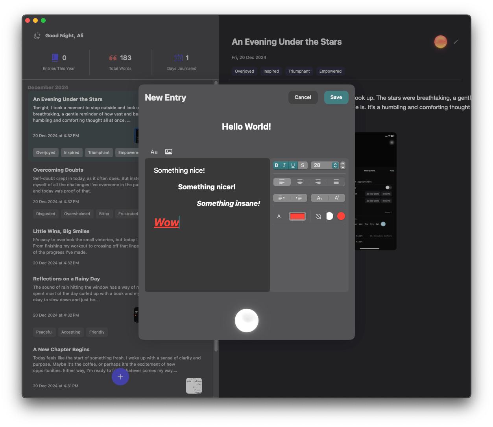

  
  <h1>Journal for macOS</h1>
  
A native journaling app for macOS inspired by Apple's Journal app for iOS

  

    
    
    
  

## 🌟 About

Since Apple hasn't brought their beautiful Journal app to macOS yet, I decided to create a native macOS version that captures the same elegant simplicity and thoughtful features. This app lets you document your thoughts, track emotions, and reflect on your days - all with a clean, native macOS interface.

  

## Features

- Clean, distraction-free writing experience
- Beautiful, native macOS design
- Track your emotions with an intuitive Emotion Orb
- Insightful writing statistics
- Organized by months
- Supports system appearance
- Fast and lightweight

## Screenshots

  
    
  

## Getting Started

### Requirements
- macOS 13.0 or later
- Xcode 15.0 or later

### Installation
1. Clone the repository
2. Open `Journal for macOS.xcodeproj` in Xcode
3. Build and run

## Tech Stack

- SwiftUI for the UI
- UserDefaults for local storage
- SwiftUI Introspect for native controls
- RichTextKit for text formatting
- Sparkle for automatic updates
- Orb for intuitive emotion tracking

## License

MIT License. See [LICENSE](LICENSE) for more information.

## 🤝 Contributing

Contributions, issues, and feature requests are welcome! Feel free to check the [issues page](issues).

## 👤 Author

**Ali Nasser**

- Twitter: [@alijnxo](https://twitter.com/alijnxo)
- GitHub: [@itssali](https://github.com/itssali)

---

  Made with ❤️ for the Mac

